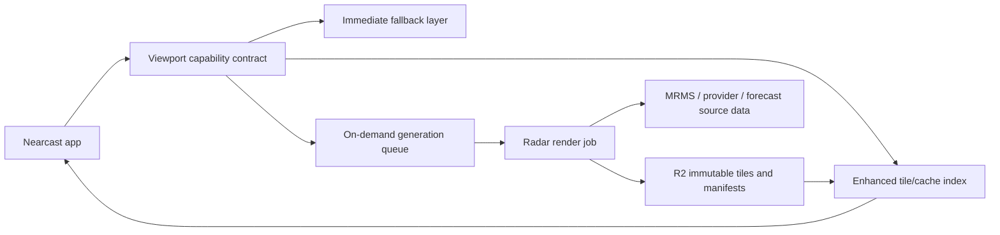
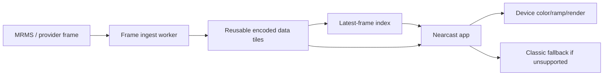

# Nearcast radar architecture

Decision record for moving the radar/map system from a successful regional MRMS
prototype to a scalable, beautiful, search-anywhere product surface.

> July 2026 update: the generated MRMS substrate remains archived as a spike,
> not the active main-app direction. See
> `docs/generated-mrms-spike-archive.md` for the product/cost decision and the
> experiment revival criteria.

## Product target

Users should be able to search any place, zoom, pan, and scrub the precipitation
timeline without thinking about sources, packs, manifests, or tile generation.

The map should always show the best truthful weather visual available:

- Immediate radar or precipitation fallback for the current viewport.
- Enhanced high-resolution rendering when Nearcast has fresh generated or
  encoded data for that area.
- Quiet background warming when the viewport is worth generating but not ready.
- No blank map, no required app relaunch, and no provider-shaped UI language.

The user experience should feel like one continuous weather surface. Source
changes are implementation details; visually they should be fades, not modes.

## Current state

Nearcast already has the important pieces of a real substrate:

- MapLibre is the default renderer for the immersive map path.
- Generated MRMS manifests are source-agnostic enough to also carry future
  forecast maps or commercial provider outputs.
- `radar/mrms/index.json` routes by coverage instead of assuming one generated
  region.
- Generated frames can point at R2 or another public tile origin.
- Encoded value tiles can be colorized on the user's device, with colored PNGs
  kept as a fallback path.
- Sparse empty tiles are expected and should render as transparent weather.

That is a strong prototype. It is not the production scale model.

The scheduled regional-pack publisher is useful for experiments and hot-area
warming, but it should not become a world/continent/country pre-rendering
system. Tile count, object churn, freshness windows, and compute time all grow
too quickly when generation is tied to geography instead of user attention.

## Reality check from live storm testing

The June 30 Green Bay/New London storm test exposed the core problem with the
current preview path:

- The app can correctly request enhancement.
- The capability Worker can store a bounded render plan.
- The GitHub/R2 runner can render and publish a good pack when manually kicked.
- But the user can still sit on "Enhancing radar" while the storm moves because
  the preview runner is an asynchronous batch job with schedule delay, runner
  startup, render time, object upload time, and a short freshness window.

That is not a product-quality storm experience. During active weather, a user
expects the radar surface to follow the storm immediately as they search, zoom,
and pan. A per-viewport tile-pack queue chases the user's last view; it does not
provide a continuous radar substrate.

GitHub Actions also cannot be treated as the production radar clock. Its
scheduled event is documented as delay-prone under load, and queued scheduled
jobs can be dropped. Offsetting the preview schedule away from minute zero may
reduce missed runs, but it does not change the architecture conclusion.

Nearcast should keep the current on-demand pack path only as a bridge for
experiments, hot-area warming, and visual-quality comparison. The production
path should ingest each source frame once, publish a reusable data substrate,
and let the app or an edge tile service render the current viewport instantly.

## Architecture stance

Nearcast should use a hybrid progressive radar architecture.

1. **Instant global fallback**
   Load a reliable provider-backed radar or precipitation layer immediately so
   the map never feels empty.

2. **Enhanced cache**
   If fresh generated or encoded tiles already cover the viewport, fade them in
   above the fallback.

3. **On-demand generation**
   When a searched or panned viewport is not enhanced yet, enqueue work for that
   viewport, dedupe it, and publish immutable artifacts to object storage. This
   is a warming/bridge path, not the primary live-storm path.

4. **Client-side rendering**
   Prefer compact encoded value tiles over pre-colored PNG-only output. The
   server should decode, normalize, crop, and tile the weather field; the device
   should colorize, animate, and apply zoom-aware styling.

5. **Selective warming**
   Precompute only low/mid-zoom overviews, saved places, hot metros, active
   storms, and recently requested viewports. Do not pre-render everywhere.

6. **Truthful coverage**
   MRMS is the preferred U.S. radar substrate where valid. Outside that coverage,
   Nearcast should use the best available fallback, commercial provider, model,
   or satellite-derived layer without pretending it has MRMS-quality data.

## Target components



### App

The app asks for the best precipitation capability for the current viewport and
time range. It does not hard-code product decisions into UI state.

Responsibilities:

- Show fallback immediately.
- Load enhanced frames when a manifest says they are fresh and relevant.
- Keep the previous layer visible while a better layer is loading.
- Report source decisions and timing through diagnostics.
- Never surface provider names as normal UX copy unless required by attribution.

### Capability contract

The capability contract is the routing layer between the app and weather
production.

It should answer:

- What source should the app show immediately?
- Is an enhanced layer already ready for this viewport?
- Is a background generation request accepted, deduped, already running, or not
  supported?
- What freshness and coverage limits apply?

Draft response shape:

```json
{
  "provider": "nearcast-radar-capabilities",
  "version": 1,
  "viewport": {
    "center": { "latitude": 47.505, "longitude": -111.300 },
    "zoom": 10,
    "bounds": { "minLat": 46.9, "minLon": -112.4, "maxLat": 48.2, "maxLon": -110.2 }
  },
  "immediate": {
    "kind": "fallback-radar",
    "label": "Radar",
    "manifestUrl": null
  },
  "enhanced": {
    "state": "ready",
    "kind": "encoded-radar",
    "manifestUrl": "https://getnearcast.app/radar/mrms/packs/great-falls/manifest.json",
    "coverageBounds": { "minLat": 46.9, "minLon": -112.4, "maxLat": 48.2, "maxLon": -110.2 },
    "generatedAt": "2026-06-29T13:41:57Z",
    "expiresAt": "2026-06-29T15:41:57Z"
  },
  "generation": {
    "state": "not-needed",
    "requestId": null,
    "reason": "fresh-enhanced-layer"
  }
}
```

### Generation service

The generation service should not be coupled to app deployment, and it should
not render a unique visual tile pyramid for every user viewport as the default
path.

Responsibilities:

- Discover current source frames.
- Decode and normalize weather fields.
- Publish source-frame data tiles once per product/frame/render profile.
- Crop or tile requested coverage only for bridge warming or special high-detail
  packs.
- Emit encoded value tiles plus optional PNG fallback tiles where needed.
- Publish immutable frame artifacts to R2.
- Write or update small manifests and indexes.
- Dedupe equivalent viewport/source/render requests.
- Expire old artifacts by lifecycle rules instead of deleting aggressively in
  the hot path.

Cloudflare Workers are a good control plane for capability lookup, request
dedupe, and queueing. The heavy decode/render job may need a small container or
job runner if it exceeds Worker CPU, memory, or wall-time constraints.

### Object storage

R2 is the durable artifact store, not the compute strategy.

Object keys should be immutable and source-addressed:

```text
mrms/{product}/{source-frame}/{render-profile}/{z}/{x}/{y}.png
mrms/{product}/{source-frame}/{render-profile}/data/{z}/{x}/{y}.png
manifests/{pack-id}/{source-signature}/{render-profile}.json
```

Mutable files should be small routing objects only:

```text
radar/mrms/index.json
radar/mrms/packs/{pack-id}/manifest.json
radar/capabilities/{geohash-or-viewport-key}.json
```

In the target state, the hottest mutable routing object points to the latest
source frames and data-tile templates, not to a growing list of short-lived
place-specific visual packs.

## Target production shape

The production radar path should be frame-first:



Key properties:

- **Ingest once per frame.** Do not regenerate the same weather field for every
  place search.
- **Render everywhere from the same substrate.** Search, pan, and zoom should
  discover already-published frame data, not start a new job.
- **Keep fallback immediate.** The classic radar fallback remains visible until
  the enhanced frame is ready on-device.
- **Use on-demand packs only for gaps.** On-demand jobs can warm a storm corridor
  or a deep-zoom high-detail area, but the user should not depend on them for
  basic live radar.
- **Separate freshness from beauty.** Fresh frame availability is a data problem;
  saturated colors, smoothing, opacity, and label readability are client render
  problems.

This moves cost from "number of users times number of viewed places" toward
"number of source frames times bounded data-tile profiles." That is the only
shape that can follow storms without exploding object count or waiting on
per-user batch work.

## UX target for enhanced radar

The user flow should be:

1. Search or open a place.
2. Map recenters immediately.
3. Fallback radar is visible immediately if precipitation exists.
4. The app checks the latest enhanced frame index.
5. If the device supports enhanced rendering and fresh data covers the viewport,
   the enhanced layer fades in.
6. If not, the fallback remains the radar experience; background warming is
   silent or very lightly indicated.

The normal user should not see a long-running "Enhancing radar" state. A short
"Checking radar" affordance is acceptable. Anything longer than a few seconds
should become a quiet fallback state, not a promise that the map is about to
upgrade.

## Migration plan from today's prototype

### Step 1: Stabilize the bridge

- Keep the pending-plan runner as a preview tool.
- Offset the GitHub schedule away from minute zero to reduce dropped runs.
- Keep the processed-marker freshness window shorter than the published pack TTL
  so a viewport can regenerate as soon as the visible enhanced pack expires.
- Add monitoring for "queued plan age" and "latest published pack age."
- Make the app stop presenting enhancement as pending after a short timeout.

### Step 2: Build the frame-first substrate

- Add a frame-ingest job that fetches the latest MRMS product on a real clock.
- Decode once and publish reusable encoded data tiles for a coarse CONUS profile.
- Publish a small `latest-frame-index.json` with frame time, expiry, product,
  tile template, and attribution.
- Teach the app to load this index before considering viewport-pack generation.

Initial implementation:

- `scripts/mrms-prototype/publish-mrms-frame-substrate.mjs` publishes a
  frame-first MRMS substrate from the latest public MRMS source frame.
- The first geography profile is `conus`, with encoded z5-z8 data tiles,
  skipped empty tiles, active-first higher-zoom planning, a short freshness
  window, and a generous `maxClientOverzoom` ceiling. The broad substrate should
  generally stay visible during deep zoom because visual continuity is better
  than popping back to the classic fallback, even when the z8 source begins to
  soften.
- The mutable app entrypoint is
  `radar/mrms/frame-substrate/latest-frame-index.json`; immutable manifests and
  tiles live below source-signature-scoped frame-substrate paths.
- `.github/workflows/publish-mrms-frame-substrate.yml` is a gated bridge runner:
  it can check every two minutes, resolve the latest MRMS source, skip unchanged
  frames, publish artifacts to R2, and upload the latest index with `no-store`
  cache-control. This is useful for testing the contract, but the target
  production clock should still move to a purpose-built scheduled worker or job
  runner if GitHub Actions timing becomes the bottleneck.
- The app now checks the frame-substrate index before the existing generated
  pack index. If it is absent, stale, out of coverage, or beyond the allowed
  overzoom range, the existing generated-index and fallback paths continue to
  handle the viewport.
- The production capability Worker must follow the same order because the live
  app asks `/api/radar/capability` before local index fallback: frame-substrate
  index first, on-demand preview index second, static generated index last.

### Step 3: Move color and polish to the client

- Treat encoded tiles as the normal path.
- Colorize with the current Nearcast radar palette on the device.
- Tune smoothing, opacity, and zoom styling in the app, not in a server PNG
  bake.
- Keep PNG fallback only for browsers/devices that cannot handle the enhanced
  path.

### Step 4: Use warming deliberately

- Warm active storm corridors, saved places, and popular viewports from the same
  source-frame data.
- Micro-detail around saved places should require active precipitation nearby,
  a fresh MRMS frame, and a quota. Saved places are a prioritization signal, not
  a reason to generate clear-weather z12-z13 tiles.
- Do not build country-sized visual packs on every update.
- Use lifecycle rules and immutable keys so old frames age out cheaply.

### Step 5: Decide provider vs own-the-pipeline

- If a commercial MapsGL-style provider gives the same data-driven rendering,
  legal fit, and predictable pricing, it can replace much of the custom ingest
  path.
- If not, MRMS raw data remains the U.S. premium radar substrate, with a separate
  global provider/fallback strategy outside MRMS coverage.

## Source strategy

### United States radar

Use MRMS as the premium radar substrate where coverage is valid. Keep evaluating
which MRMS product best matches user expectation:

- Composite reflectivity for classic storm structure.
- Lowest-altitude reflectivity for ground-truth rain-now decisions.
- Precipitation rate for a softer rain-intensity surface.

### Outside MRMS coverage

Use a layered strategy:

- Commercial MapsGL-style provider if the terms, quality, and pricing work.
- Existing fallback radar where it is acceptable.
- Forecast/precipitation model layers for future timeline frames.
- Satellite or cloud/rain proxy only if clearly labeled and visually distinct.

No single source should be forced to solve every country and zoom level.

## Cost model

The production cost goal is simple:

Spend should follow user attention, not land area.

Bad cost shape:

- Render every tile for large regions on every source update.
- Upload thousands of objects for places nobody is viewing.
- Tie freshness to full app redeploys.

Good cost shape:

- Render only current or predicted demand.
- Reuse hot viewport artifacts.
- Generate fewer source zooms and let the client style responsibly.
- Publish immutable objects once and cache them hard.
- Keep manifests small, fresh, and no-cache.

## UX rules

- Search recenters immediately.
- Pan and zoom preserve the current layer until a replacement is ready.
- Enhanced radar fades in; fallback does not flash out.
- Expired enhanced data is not shown as current radar.
- Sparse empty generated tiles render as transparent weather, not errors.
- Normal users see weather language, not provider language.
- Diagnostics can expose source details for engineering.

## Implementation sequence

### Phase 1: Decision visibility

- Add a durable architecture doc.
- Add hidden source-decision diagnostics in the app.
- Record why enhanced radar was selected or skipped.
- Record fallback source, manifest age, coverage, and errors.

### Phase 2: Capability contract

- Add a static/local capability resolver matching the target response shape.
- Route current generated index selection through that contract.
- Keep current fallback behavior unchanged.

Initial local implementation:

- `map.js` exposes `window.nearcastRadarCapability()` for engineering checks.
- `map.js` exposes `window.nearcastRequestRadarGeneration()` to exercise the
  future warming path for the current viewport.
- The resolver returns the target capability shape from today's local
  `radar/mrms/index.json` and legacy manifest fallback.
- Generated MRMS selection now flows through the capability object before
  loading a manifest, preserving existing fallback behavior while creating the
  seam for a future Worker-backed endpoint.
- Generated MRMS index selection records bounded quality diagnostics: selected
  pack, ranked candidate summaries, source zoom range, overzoom, coverage
  overlap, and tile/data counts. These are exposed through
  `window.nearcastRadarDiagnostics()` and the existing MapLibre diagnostic
  readout when `mapPerf` is active.
- A capability endpoint can be tested by setting
  `?radarCapabilityEndpoint=/api/radar/capability` or the
  `nearcast-radar-capability-endpoint` localStorage key. When no endpoint is
  configured, the app stays local/static and generation requests report
  `unsupported`.

Endpoint request shape:

```json
{
  "provider": "nearcast-radar-capability-request",
  "version": 1,
  "requestedAt": "2026-06-29T16:50:00Z",
  "viewport": {
    "center": { "latitude": 47.505, "longitude": -111.300 },
    "activePoint": { "latitude": 47.505, "longitude": -111.300 },
    "zoom": 10,
    "bounds": { "minLat": 46.9, "minLon": -112.4, "maxLat": 48.2, "maxLon": -110.2 },
    "key": "47.50,-111.30,z10"
  },
  "preferences": {
    "radarProvider": "auto",
    "mapRenderer": "gl",
    "timelineKind": "radar",
    "immersive": false
  },
  "generation": {
    "request": true,
    "reason": "viewport"
  }
}
```

### Phase 3: On-demand prototype

- Add an authenticated capability endpoint.
- Enqueue a generation request for one viewport when enhanced data is absent.
- Generate one current-frame encoded tile set for a bounded bbox.
- Publish to R2 and return a manifest URL.
- Let the app switch to enhanced without reload.

Current scaffold:

- `workers/radar-capability.mjs` is configured as the opt-in
  `/api/radar/capability` control-plane endpoint.
- The endpoint can resolve ready enhanced packs from the deployed
  `radar/mrms/index.json` through an assets binding.
- The endpoint can also read an external generated-radar index by setting
  `RADAR_GENERATION_INDEX_URL`, which lets preview/on-demand packs published to
  R2 be discovered without a static app deploy.
- It reports generation as `unsupported` without queue and request-state
  bindings, queues only when both are present, and dedupes repeated viewport
  requests for a short window.
- It applies soft hourly global and per-viewport generation budgets before
  queueing work. These are preview safety rails; broad production use still
  needs authenticated identity and a stronger atomic throttle.
- Preview deploys bind `RADAR_GENERATION_QUEUE` as a producer and store
  request-state/budget records in a private radar-state R2 bucket. This keeps
  on-demand acceptance testable without adding a KV namespace yet.
- The active Worker also consumes `RADAR_GENERATION_QUEUE` messages and stores
  bounded render plans in private R2. This makes queue acceptance observable as
  durable work without activating the expensive renderer yet.
- Queued preview render plans publish under
  `radar/mrms/on-demand-preview/...`, keeping manual on-demand experiments out
  of the future production `on-demand` namespace.
- `scripts/radar-capability-smoke.mjs` verifies ready, unsupported, queued,
  deduped, limited, KV-backed request state, R2-backed request state, Worker
  endpoint routing, Worker queue handling, and static asset passthrough locally
  without Cloudflare.
- `workers/radar-generation-consumer.mjs` implements the queue-side contract.
  It validates accepted generation messages, normalizes viewport
  bounds, estimates candidate tile counts, rejects over-budget jobs, and emits a
  stable render plan with source-signature-scoped output key templates.
- `scripts/radar-generation-consumer-smoke.mjs` verifies valid planning,
  invalid payload rejection, tile-budget rejection, stable output keys, queue
  ack behavior, and KV/R2 plan storage locally without Cloudflare.
- `.github/workflows/verify-radar-generation-queue.yml` posts a unique
  no-pack viewport to the live capability endpoint and verifies the expected
  render plan appears in the private state bucket.
- `scripts/radar-generation-renderer.mjs` executes a persisted render plan
  offline. It resolves and pins the MRMS source, substitutes the source
  signature into output keys, runs the bounded timeline generator, and writes a
  generated manifest plus an index-pack artifact.
- `scripts/radar-generation-renderer-smoke.mjs` verifies that render execution
  contract with a fake generator, so it does not depend on NOAA network access
  or real GRIB2 decoding.
- `scripts/radar-generation-publisher.mjs` publishes a render result into the
  generated-radar index contract in `dry-run`, `local-r2`, or explicit `r2`
  mode. It collects sparse artifact files, preserves exact on-demand object
  keys, rewrites public manifest URLs, merges the source-scoped pack into the
  index, prunes expired packs, uploads the planned object set when credentials
  are provided manually, and writes the mutable `radar/mrms/index.json`
  separately from immutable pack artifacts. Manual `r2` runs require the same
  temporary `@aws-sdk/client-s3` dependency used by the current generated-MRMS
  R2 uploader.
- `scripts/radar-generation-publisher-smoke.mjs` verifies object planning,
  local R2 mirroring, injected-client R2 upload, expired-pack pruning, pack
  replacement, and index output without Cloudflare credentials.
- `scripts/radar-generation-preview-plan.mjs` creates a bounded non-live
  preview render plan for the existing MRMS renderer.
- `scripts/radar-generation-preview-fixture.mjs` still creates a tiny synthetic
  preview render result for credentialed R2 upload checks.
- `.github/workflows/radar-generation-r2-preview.yml` manually runs either the
  bounded real MRMS preview render or the fixture path, uploads artifacts under
  `radar/mrms/on-demand-preview/...`, and writes
  `radar/mrms/on-demand-preview/index.json`, leaving the live app index and
  deploy path untouched.
- `.github/workflows/process-radar-generation-plan.yml` is the manual bridge
  from the live queue path to the renderer/publisher path. It fetches a private
  render plan from the `nearcast-radar-state` bucket, renders the bounded MRMS
  artifact set, plans the preview-index merge, and can either stop at `dry-run`
  or upload to R2. It blocks empty R2 publishes by default so a no-precip test
  viewport does not create a misleading enhanced pack.
- `scripts/radar-generation-plan-queue.mjs` and
  `.github/workflows/process-pending-radar-generation-plans.yml` add the first
  preview runner loop. The queue consumer writes a latest-plan pointer in
  private R2 for user-facing render work, and the workflow reads that pointer,
  skips verification plans or plans with processed markers, renders the pending
  plan, publishes through the same preview index path, and marks successful or
  intentionally skipped work so it is not repeatedly rendered.
- The pending-plan runner has a five-minute schedule, but scheduled execution is
  gated by `ENABLE_RADAR_GENERATION_RUNNER=safe` or
  `ENABLE_RADAR_GENERATION_RUNNER=true`. The `safe` profile is the preferred
  preview mode while the architecture is still being hardened: one pending plan
  per run, capped upload concurrency, capped preview index size, public
  verification, no empty publishes, and age-aware processed markers so stale
  empty results do not permanently suppress retries.
- A real Great Falls preview upload has verified the R2 object layout through
  the public origin: preview index, pack manifest, and encoded tile URLs are
  externally readable after upload.
- The app can load the preview index for engineering tests with
  `?map=gl&radar=mrms-generated&radarIndex=preview` or
  `window.nearcastUseRadarPreviewIndex(true)`. The preview toggle clears any
  sticky explicit manifest override so stale local-storage settings do not pin
  the app to the legacy fallback manifest. The default user path still uses the
  live static index and fallback chain.
- Add `mapPerf=current` while testing preview quality to show the internal
  readout for selected pack, source zoom, overzoom, candidate counts, coverage,
  and tile/data counts without adding normal user-facing controls.
- `config/radar-r2-cors.json` lets the preview R2 custom domain serve index,
  manifest, encoded-data, and tile objects to the app origin. The manual preview
  upload workflow applies it when `CLOUDFLARE_API_TOKEN` is present.
- The preview workflow now uses z8-z12 source tiles by default and merges with
  the current preview index. That supports a quality ladder: broad packs for
  search/pan continuity, plus smaller high-zoom packs when deep zoom exposes
  too much overzoom softness.
- `.github/workflows/deploy-cloudflare-app.yml` deploys app/control-plane
  changes without running MRMS generation, so Worker activation is no longer
  coupled to the generated-radar publisher. It also ensures the preview
  generation queue and private state bucket exist before deploying the
  capability Worker.

Still missing before broad activation:

- Production queue/renderer R2 credential wiring and bucket policy review.
- Production-grade job runner outside GitHub Actions if preview workloads exceed
  CI ergonomics, timing, or cost limits.
- App-side enhanced-layer refresh after a generated pack becomes ready.

### Phase 4: Scale controls

- Dedupe jobs by source frame, product, render profile, zoom range, and viewport
  hash.
- Add request budgets, per-user throttles, and hot-region warming.
- Add lifecycle cleanup and object-count reporting.
- Add synthetic checks for searched places and storm-active regions.

### Phase 5: Broader coverage

- Run a commercial provider bake-off for non-MRMS coverage and global quality.
- Put provider output behind the same manifest/capability contract.
- Keep the UX source-agnostic.

## Current non-goals

- Do not build a global pre-render pipeline.
- Do not expose generation status as core UX.
- Do not decode GRIB2 in the browser.
- Do not let a provider switch become a user-facing mode.
- Do not couple radar generation to static app deploys long term.
