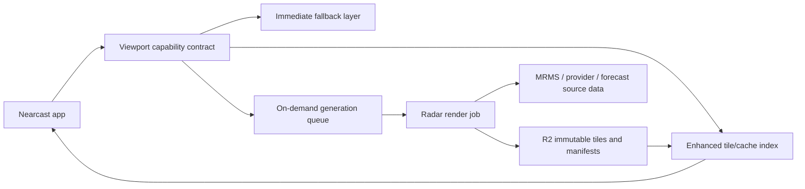

# Nearcast radar architecture

Decision record for moving the radar/map system from a successful regional MRMS
prototype to a scalable, beautiful, search-anywhere product surface.

## Product target

Users should be able to search any place, zoom, pan, and scrub the precipitation
timeline without thinking about sources, packs, manifests, or tile generation.

The map should always show the best truthful weather visual available:

- Immediate radar or precipitation fallback for the current viewport.
- Enhanced high-resolution rendering when Nearcast has fresh generated or
  encoded data for that area.
- Quiet background warming when the viewport is worth generating but not ready.
- No blank map, no required app relaunch, and no provider-shaped UI language.

The user experience should feel like one continuous weather surface. Source
changes are implementation details; visually they should be fades, not modes.

## Current state

Nearcast already has the important pieces of a real substrate:

- MapLibre is the default renderer for the immersive map path.
- Generated MRMS manifests are source-agnostic enough to also carry future
  forecast maps or commercial provider outputs.
- `radar/mrms/index.json` routes by coverage instead of assuming one generated
  region.
- Generated frames can point at R2 or another public tile origin.
- Encoded value tiles can be colorized on the user's device, with colored PNGs
  kept as a fallback path.
- Sparse empty tiles are expected and should render as transparent weather.

That is a strong prototype. It is not the production scale model.

The scheduled regional-pack publisher is useful for experiments and hot-area
warming, but it should not become a world/continent/country pre-rendering
system. Tile count, object churn, freshness windows, and compute time all grow
too quickly when generation is tied to geography instead of user attention.

## Architecture stance

Nearcast should use a hybrid progressive radar architecture.

1. **Instant global fallback**
   Load a reliable provider-backed radar or precipitation layer immediately so
   the map never feels empty.

2. **Enhanced cache**
   If fresh generated or encoded tiles already cover the viewport, fade them in
   above the fallback.

3. **On-demand generation**
   When a searched or panned viewport is not enhanced yet, enqueue work for that
   viewport, dedupe it, and publish immutable artifacts to object storage.

4. **Client-side rendering**
   Prefer compact encoded value tiles over pre-colored PNG-only output. The
   server should decode, normalize, crop, and tile the weather field; the device
   should colorize, animate, and apply zoom-aware styling.

5. **Selective warming**
   Precompute only low/mid-zoom overviews, saved places, hot metros, active
   storms, and recently requested viewports. Do not pre-render everywhere.

6. **Truthful coverage**
   MRMS is the preferred U.S. radar substrate where valid. Outside that coverage,
   Nearcast should use the best available fallback, commercial provider, model,
   or satellite-derived layer without pretending it has MRMS-quality data.

## Target components



### App

The app asks for the best precipitation capability for the current viewport and
time range. It does not hard-code product decisions into UI state.

Responsibilities:

- Show fallback immediately.
- Load enhanced frames when a manifest says they are fresh and relevant.
- Keep the previous layer visible while a better layer is loading.
- Report source decisions and timing through diagnostics.
- Never surface provider names as normal UX copy unless required by attribution.

### Capability contract

The capability contract is the routing layer between the app and weather
production.

It should answer:

- What source should the app show immediately?
- Is an enhanced layer already ready for this viewport?
- Is a background generation request accepted, deduped, already running, or not
  supported?
- What freshness and coverage limits apply?

Draft response shape:

```json
{
  "provider": "nearcast-radar-capabilities",
  "version": 1,
  "viewport": {
    "center": { "latitude": 47.505, "longitude": -111.300 },
    "zoom": 10,
    "bounds": { "minLat": 46.9, "minLon": -112.4, "maxLat": 48.2, "maxLon": -110.2 }
  },
  "immediate": {
    "kind": "fallback-radar",
    "label": "Radar",
    "manifestUrl": null
  },
  "enhanced": {
    "state": "ready",
    "kind": "encoded-radar",
    "manifestUrl": "https://getnearcast.app/radar/mrms/packs/great-falls/manifest.json",
    "coverageBounds": { "minLat": 46.9, "minLon": -112.4, "maxLat": 48.2, "maxLon": -110.2 },
    "generatedAt": "2026-06-29T13:41:57Z",
    "expiresAt": "2026-06-29T15:41:57Z"
  },
  "generation": {
    "state": "not-needed",
    "requestId": null,
    "reason": "fresh-enhanced-layer"
  }
}
```

### Generation service

The generation service should not be coupled to app deployment.

Responsibilities:

- Discover current source frames.
- Decode and normalize weather fields.
- Crop or tile only the requested coverage.
- Emit encoded value tiles plus optional PNG fallback tiles.
- Publish immutable frame artifacts to R2.
- Write or update small manifests and indexes.
- Dedupe equivalent viewport/source/render requests.
- Expire old artifacts by lifecycle rules instead of deleting aggressively in
  the hot path.

Cloudflare Workers are a good control plane for capability lookup, request
dedupe, and queueing. The heavy decode/render job may need a small container or
job runner if it exceeds Worker CPU, memory, or wall-time constraints.

### Object storage

R2 is the durable artifact store, not the compute strategy.

Object keys should be immutable and source-addressed:

```text
mrms/{product}/{source-frame}/{render-profile}/{z}/{x}/{y}.png
mrms/{product}/{source-frame}/{render-profile}/data/{z}/{x}/{y}.png
manifests/{pack-id}/{source-signature}/{render-profile}.json
```

Mutable files should be small routing objects only:

```text
radar/mrms/index.json
radar/mrms/packs/{pack-id}/manifest.json
radar/capabilities/{geohash-or-viewport-key}.json
```

## Source strategy

### United States radar

Use MRMS as the premium radar substrate where coverage is valid. Keep evaluating
which MRMS product best matches user expectation:

- Composite reflectivity for classic storm structure.
- Lowest-altitude reflectivity for ground-truth rain-now decisions.
- Precipitation rate for a softer rain-intensity surface.

### Outside MRMS coverage

Use a layered strategy:

- Commercial MapsGL-style provider if the terms, quality, and pricing work.
- Existing fallback radar where it is acceptable.
- Forecast/precipitation model layers for future timeline frames.
- Satellite or cloud/rain proxy only if clearly labeled and visually distinct.

No single source should be forced to solve every country and zoom level.

## Cost model

The production cost goal is simple:

Spend should follow user attention, not land area.

Bad cost shape:

- Render every tile for large regions on every source update.
- Upload thousands of objects for places nobody is viewing.
- Tie freshness to full app redeploys.

Good cost shape:

- Render only current or predicted demand.
- Reuse hot viewport artifacts.
- Generate fewer source zooms and let the client style responsibly.
- Publish immutable objects once and cache them hard.
- Keep manifests small, fresh, and no-cache.

## UX rules

- Search recenters immediately.
- Pan and zoom preserve the current layer until a replacement is ready.
- Enhanced radar fades in; fallback does not flash out.
- Expired enhanced data is not shown as current radar.
- Sparse empty generated tiles render as transparent weather, not errors.
- Normal users see weather language, not provider language.
- Diagnostics can expose source details for engineering.

## Implementation sequence

### Phase 1: Decision visibility

- Add a durable architecture doc.
- Add hidden source-decision diagnostics in the app.
- Record why enhanced radar was selected or skipped.
- Record fallback source, manifest age, coverage, and errors.

### Phase 2: Capability contract

- Add a static/local capability resolver matching the target response shape.
- Route current generated index selection through that contract.
- Keep current fallback behavior unchanged.

Initial local implementation:

- `map.js` exposes `window.nearcastRadarCapability()` for engineering checks.
- `map.js` exposes `window.nearcastRequestRadarGeneration()` to exercise the
  future warming path for the current viewport.
- The resolver returns the target capability shape from today's local
  `radar/mrms/index.json` and legacy manifest fallback.
- Generated MRMS selection now flows through the capability object before
  loading a manifest, preserving existing fallback behavior while creating the
  seam for a future Worker-backed endpoint.
- A capability endpoint can be tested by setting
  `?radarCapabilityEndpoint=/api/radar/capability` or the
  `nearcast-radar-capability-endpoint` localStorage key. When no endpoint is
  configured, the app stays local/static and generation requests report
  `unsupported`.

Endpoint request shape:

```json
{
  "provider": "nearcast-radar-capability-request",
  "version": 1,
  "requestedAt": "2026-06-29T16:50:00Z",
  "viewport": {
    "center": { "latitude": 47.505, "longitude": -111.300 },
    "activePoint": { "latitude": 47.505, "longitude": -111.300 },
    "zoom": 10,
    "bounds": { "minLat": 46.9, "minLon": -112.4, "maxLat": 48.2, "maxLon": -110.2 },
    "key": "47.50,-111.30,z10"
  },
  "preferences": {
    "radarProvider": "auto",
    "mapRenderer": "gl",
    "timelineKind": "radar",
    "immersive": false
  },
  "generation": {
    "request": true,
    "reason": "viewport"
  }
}
```

### Phase 3: On-demand prototype

- Add an authenticated capability endpoint.
- Enqueue a generation request for one viewport when enhanced data is absent.
- Generate one current-frame encoded tile set for a bounded bbox.
- Publish to R2 and return a manifest URL.
- Let the app switch to enhanced without reload.

Current scaffold:

- `workers/radar-capability.mjs` implements the dormant
  `/api/radar/capability` control-plane endpoint.
- The endpoint can resolve ready enhanced packs from the deployed
  `radar/mrms/index.json` through an assets binding.
- It reports generation as `unsupported` without queue and request-state
  bindings, queues only when both are present, and dedupes repeated viewport
  requests for a short window.
- It applies soft hourly global and per-viewport generation budgets before
  queueing work. These are preview safety rails; broad production use still
  needs authenticated identity and a stronger atomic throttle.
- `scripts/radar-capability-smoke.mjs` verifies ready, unsupported, queued,
  deduped, and limited states locally without Cloudflare.
- `workers/radar-generation-consumer.mjs` implements the dormant queue-side
  contract. It validates accepted generation messages, normalizes viewport
  bounds, estimates candidate tile counts, rejects over-budget jobs, and emits a
  stable render plan with source-signature-scoped output key templates.
- `scripts/radar-generation-consumer-smoke.mjs` verifies valid planning,
  invalid payload rejection, tile-budget rejection, stable output keys, queue
  ack behavior, and optional plan storage locally without Cloudflare.
- `scripts/radar-generation-renderer.mjs` executes a persisted render plan
  offline. It resolves and pins the MRMS source, substitutes the source
  signature into output keys, runs the bounded timeline generator, and writes a
  generated manifest plus an index-pack artifact.
- `scripts/radar-generation-renderer-smoke.mjs` verifies that render execution
  contract with a fake generator, so it does not depend on NOAA network access
  or real GRIB2 decoding.
- `scripts/radar-generation-publisher.mjs` publishes a render result into the
  generated-radar index contract in `dry-run`, `local-r2`, or explicit `r2`
  mode. It collects sparse artifact files, preserves exact on-demand object
  keys, rewrites public manifest URLs, merges the source-scoped pack into the
  index, prunes expired packs, uploads the planned object set when credentials
  are provided manually, and writes the mutable `radar/mrms/index.json`
  separately from immutable pack artifacts. Manual `r2` runs require the same
  temporary `@aws-sdk/client-s3` dependency used by the current generated-MRMS
  R2 uploader.
- `scripts/radar-generation-publisher-smoke.mjs` verifies object planning,
  local R2 mirroring, injected-client R2 upload, expired-pack pruning, pack
  replacement, and index output without Cloudflare credentials.
- `scripts/radar-generation-preview-plan.mjs` creates a bounded non-live
  preview render plan for the existing MRMS renderer.
- `scripts/radar-generation-preview-fixture.mjs` still creates a tiny synthetic
  preview render result for credentialed R2 upload checks.
- `.github/workflows/radar-generation-r2-preview.yml` manually runs either the
  bounded real MRMS preview render or the fixture path, uploads artifacts under
  `radar/mrms/on-demand-preview/...`, and writes
  `radar/mrms/on-demand-preview/index.json`, leaving the live app index and
  deploy path untouched.

Still missing before activation:

- Worker activation in `wrangler.toml`.
- Request-state storage binding.
- Preview budget values.
- Queue binding and consumer deployment wiring.
- Preview R2 credentials, bucket policy, and manual end-to-end upload
  verification.
- Worker or job wiring to run the consumer, renderer, and publisher together.
- App-side enhanced-layer refresh after a generated pack becomes ready.

### Phase 4: Scale controls

- Dedupe jobs by source frame, product, render profile, zoom range, and viewport
  hash.
- Add request budgets, per-user throttles, and hot-region warming.
- Add lifecycle cleanup and object-count reporting.
- Add synthetic checks for searched places and storm-active regions.

### Phase 5: Broader coverage

- Run a commercial provider bake-off for non-MRMS coverage and global quality.
- Put provider output behind the same manifest/capability contract.
- Keep the UX source-agnostic.

## Current non-goals

- Do not build a global pre-render pipeline.
- Do not expose generation status as core UX.
- Do not decode GRIB2 in the browser.
- Do not let a provider switch become a user-facing mode.
- Do not couple radar generation to static app deploys long term.
