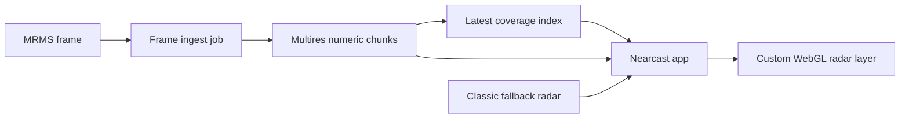

# Radar coverage engine spike

This is the next architecture spike after the generated MRMS tile-pack work.
The goal is to prove whether Nearcast can render radar as one continuous
weather field from z7.5 through deep street zoom without swapping between
visually different tile products.

## Why this path

The generated tile-pack approach proved the visual direction, but it has the
wrong production shape:

- A storm moves faster than per-viewport batch generation can reliably follow.
- Rendering colored PNG pyramids creates object churn on every MRMS frame.
- Separate source zooms create subtle shape changes as users zoom.
- The app ends up promising "enhanced" before the enhanced layer is ready.

The first-principles shape is different:

1. Ingest the source radar frame once.
2. Normalize it into a numeric precipitation coverage.
3. Publish compact multiresolution data chunks only where there is weather.
4. Let the device render color, opacity, smoothing, animation, and zoom polish.

That makes freshness a data-publish problem and beauty a client-rendering
problem. It also keeps spend tied to active weather and user attention instead
of land area.

## Target architecture

The app should still show fallback radar immediately. The chunk layer should
fade in only when the index says fresh chunks cover the viewport and the chunks
have been fetched.

## Data model

The first spike format is intentionally small and boring:

- One `index.json` per source frame.
- Gzip-compressed binary chunks under `chunks/z{level}/{x}/{y}.ncrd.gz`.
- `Uint8` reflectivity payloads, scaled from dBZ.
- `0` means no data or below the visible precip floor.
- `1..255` maps linearly across the configured dBZ range.
- Each chunk has metadata in the index: tile coordinate, byte count, min/max
  dBZ, precip pixel count, and coverage bounds.

This is not a permanent standard. It is a production-shaped experiment: simple
enough to ship, inspect, and replace.

## Levels

The important rule is that lower-resolution levels should derive from the same
canonical sampled field. They should not independently render a different visual
interpretation.

Initial levels:

- z8 for broad search/pan continuity.
- z9 for city/regional zoom.
- z10 for the first detailed layer.

For production, this can become a named ladder such as L2/L1/L0, but using
Web-Mercator-like z/x/y coordinates in the spike makes app integration easier.

Downsampling should prefer max or high-percentile pooling for reflectivity.
Mean pooling hides storm cores and makes broad views feel weaker than users
expect. Mean can still be tested for precipitation-rate products later.

## UX contract

The user experience should be:

1. Search a place.
2. The map recenters immediately.
3. Fallback radar is visible immediately if available.
4. Nearcast checks the latest coverage index quietly.
5. If chunks are fresh and cover the view, enhanced radar fades in.
6. If chunks are absent, stale, or unsupported, fallback remains the experience.

No long-running "Enhancing radar" promise. A short checking state is fine; a
multi-minute pending state belongs in diagnostics, not normal UX.

## Cost posture

This path changes the cost curve:

- Current tile-pack path: object count grows with every rendered visual zoom.
- Chunk path: object count grows with active precip chunks and retained frames.
- Client rendering: color experiments do not require republishing frame data.
- Fallback: areas without fresh chunks do not trigger emergency generation.

The first cost target is a few hundred chunks per active CONUS frame, not tens
of thousands of image tiles per frame. If a busy national storm frame needs
thousands of chunks, it can still be cheaper than colored visual pyramids
because each chunk is small, cacheable, and reused across zoom styling.

## Spike success criteria

The spike is worth continuing if:

- One source frame can encode z8-z10 chunks for a storm area quickly.
- Chunk metadata can identify active coverage without scanning every object.
- The same chunk data can render consistently at z7.5, z9, z10, z12, and z16.
- The layer can fade in over fallback without visual popping at coverage edges.
- On-device rendering keeps pan/zoom smooth on iPhone.

## Kill criteria

Stop this path, or narrow it, if:

- Chunk fetch count is worse than the existing encoded tile path for normal
  mobile viewports.
- Client rendering cannot stay smooth on iOS without large visual compromises.
- The MRMS source grid still looks worse than a premium provider after honest
  shader/style tuning.
- Operational complexity becomes similar to running a full weather-map vendor,
  but without the vendor quality.

## First implementation slice

The first implementation is intentionally offline-testable:

- `scripts/mrms-prototype/encode-mrms-chunks.mjs`
- `--synthetic` mode for deterministic local smoke tests.
- Real MRMS mode through the existing dependency-free GRIB2 decoder.
- JSON index plus gzip binary chunks.

The next slice after this is a MapLibre custom layer demo that loads this index
and renders the chunks with the current Nearcast palette in a shader.
